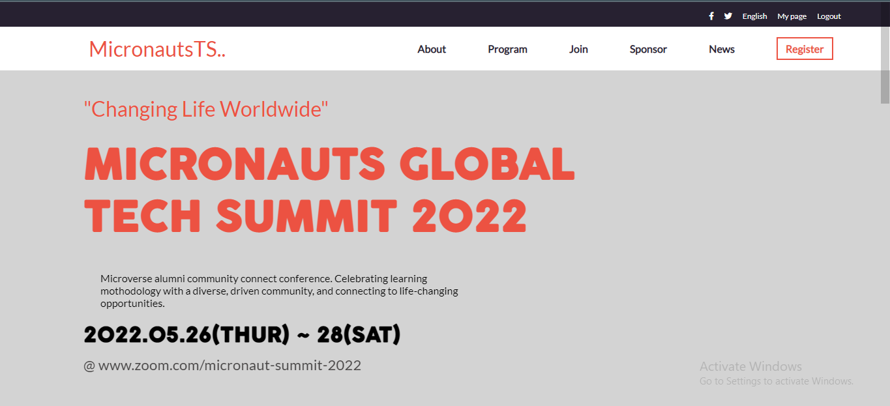

# capstone-projects1
Microverse Block 1 capstone project to build a mobile responsive conference website.

# About The Project

Microverse Block 1 Capstone project: Reponsive Conference website to test HTML, CSS, and JavaScript skills.
## Project Reqiurement
- You should personalize the content of your page. Choose a topic that is different than the one in the original design.

- You should follow these design guidelines, including:

- Colors.
- Typography: font face, size and weight.
- Layout: composition and space between elements.
- The pages should look almost identical to the original design. Small adjustments like text or image changes are acceptable.

- You can use a CSS framework (for example Bootstrap) for styling, if you want to.

- You should build only these 2 pages:

- The home page.
- The about page.
Each of these pages should have versions for 2 different screen sizes:

Mobile: up to 768px wide.
Desktop: 768px or wider.

- Interactions
Links
The home page should have a link in the menu to the about page.
The logo in the header links to the home page.

Mobile menu
When the user clicks (or taps) the hamburger button on the header, the mobile menu appears over the page.

There are no guidelines for the mobile menu in the docs, but you should implement it so it is consistent with the design (colors, typography, spacings, etc.).
The mobile menu should have a close (X) button that closes the menu.

- Dynamic page
The section "Featured speakers" should be created dynamically in JavaScript.
You should use a JavaScript variable with the data about the speakers and use it when the page loads to create the HTML for this section dynamically.
Original design idea by Cindy Shin in Behance.

# Live Preview
<a href="https://profsain.github.io/capstone-projects1/index.html">Micronauts Tech Summit 2022</a>

# Built With
<ul>
<li>HTML</li>
<li>CSS</li>
<li>JavaScript</li>
</ul>

# Getting Started
To open the project
<ol>
<li>Install your favorite Code Editor</li>
<li>Install your favorite Browser</li>
<li>Clone the project from github</li>
<li>Open index.html file in your browser</li>
</ol>

# Feature
- Responsive website
- Home page
- About page
- Dynamic Speakers card generation using javascript object
- Mobile navbar

# Author
<a href="https://linkedin.com/in/profsain">Husseini Mudi (Profsain)</a>

# Contributing
If you have a suggestion that would make this better, please fork the repo and create a pull request. 
- You can also open an issue with the tag "ënhancement"
- Don't forget to give the project a star! Happy Coding

# Acknowledgments
- Appreciate Microverse Team
- Behance.net for design inspiration

# Licence
Distributed under the MIT License. See LICENSE.txt for more information.

